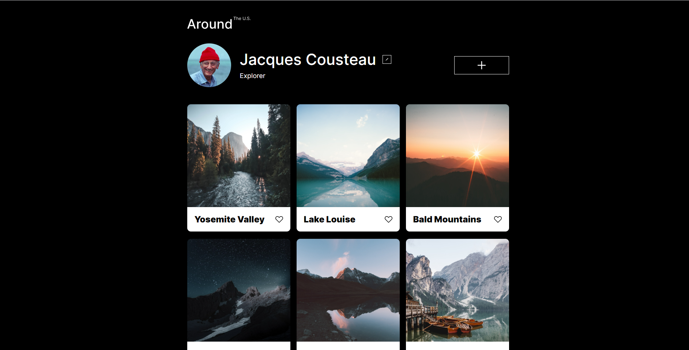
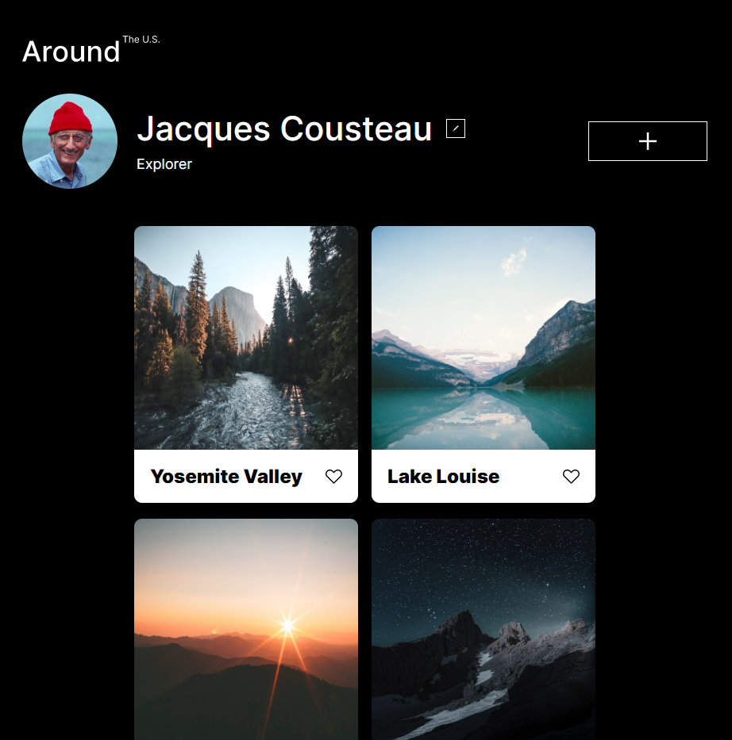
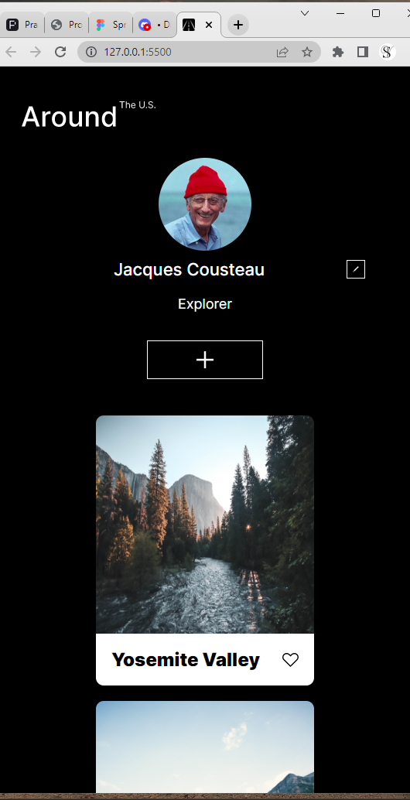

Around The US - Project 3
This design incorporates 6 photo cards and location names in a social media setup.Using HTML and CSS, the design incorporates Grid elements and media queries within a BEM structure. It is responsive to dimensions between 320-1280 px.

Github pages may be used to launch this design. https://pages.github.com/
